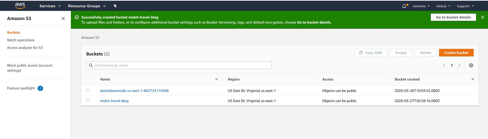
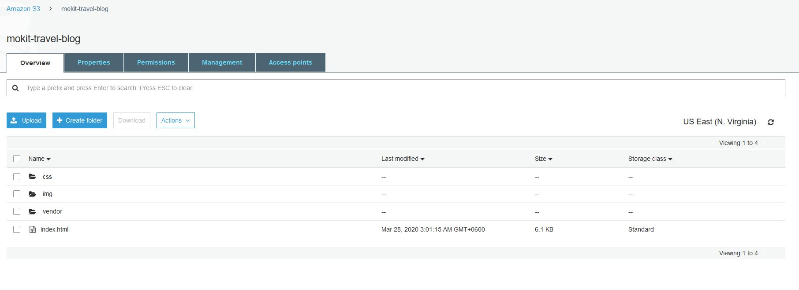
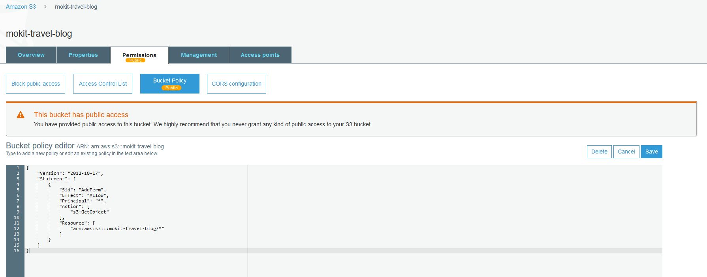
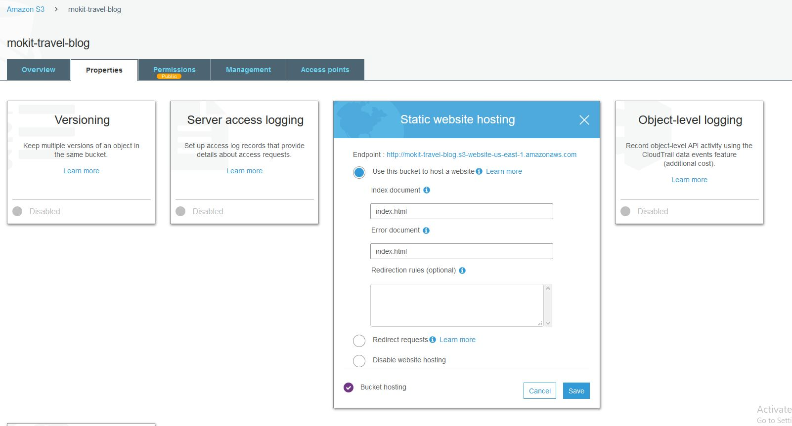
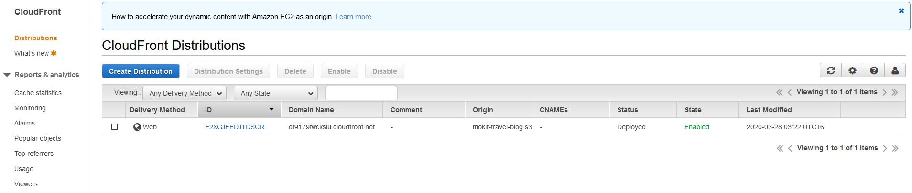

# Deploy a Static Website on AWS

## Project Overview
The cloud is perfect for hosting static websites that only include HTML, CSS, and JavaScript files that require no server-side processing. In this project, deployed a static website to AWS. Firstly, created an S3 bucket, configured the bucket for website hosting, and secured it using IAM policies. Next, uploaded the website files to your bucket and speed up content delivery using AWS’s content distribution network service, CloudFront. Lastly, accessed the website in a browser using the unique S3 endpoint. 

## File Summary
* index.html - The Index document for the website.
* /img - The background image file for the website.
* /vendor - Bootssrap CSS framework, Font, and JavaScript libraries needed for the website to function.
* /css - CSS files for the website.

## Steps of the project

1. Create a S3 bucket where need to uncheck “Block all public access”.

2. Upload the files and folders from your local computer to the S3 bucket.

3. Change the Bucket Policy according to your Bucket Policy file.

4. Make the bucket to host a website using bucket properties tab.

5. Use CloudFront dashboard create distribution and S3 bucket name use under “Origin Domain Name”.

6. Open a web browser like Google Chrome and paste the copied endpoint URL and append “/index.html” on the end.
